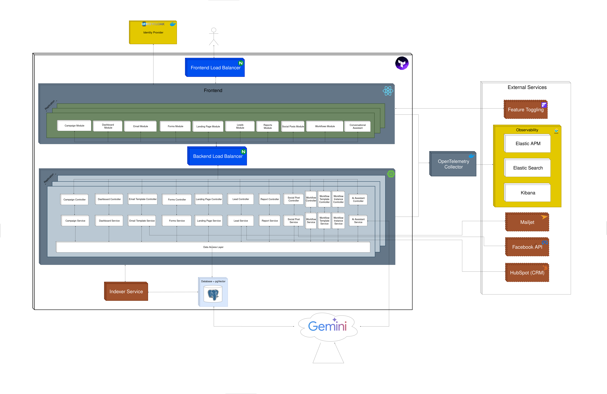
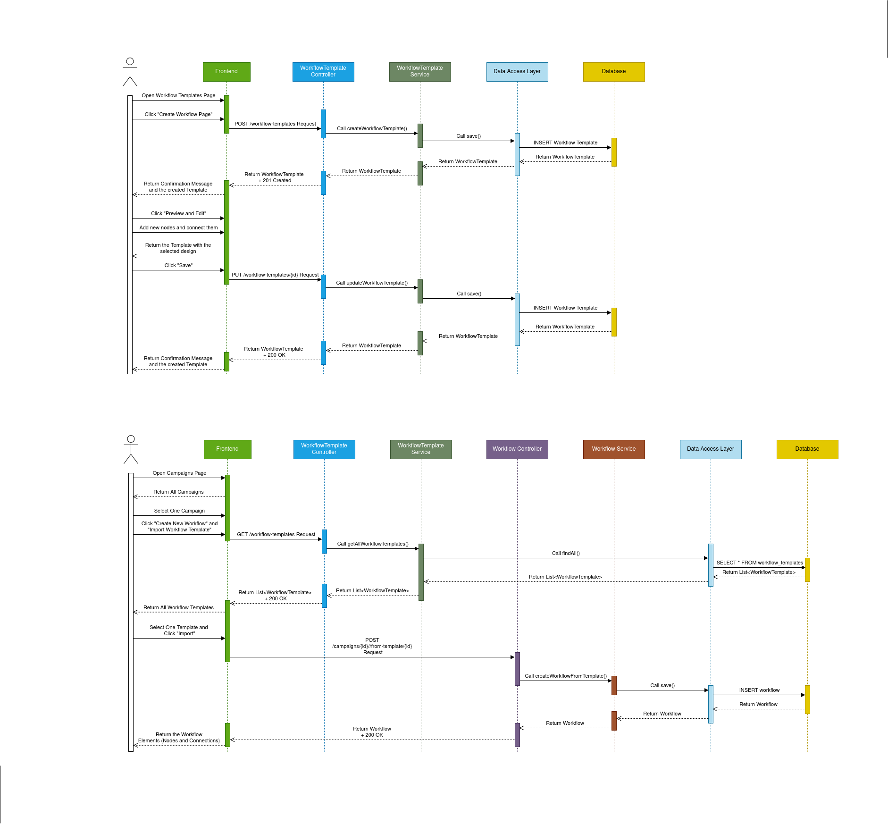

# Architecture Overview

This directory contains the documentation for the system's architecture. It provides a high-level view of all major components, their responsibilities, and how they interact across the platform.  
The architecture follows a modular, service-oriented design with clear separation between **frontend**, **backend**, **infrastructure**, and **external integrations**.

---

# 1. High-Level Architecture

The system consists of five major layers:

1. **Client Layer (User Interface)**
2. **Load Balancing Layer (NGINX Frontend & Backend LB)**
3. **Application Layer (Frontend + Backend Modules)**
4. **Infrastructure Layer (Database, Indexer, Observability, AI Services)**
5. **External Integrations (Social APIs, CRM, Email, Feature Flags)**

This layered structure ensures scalability, observability, modular maintenance, and clean separation of responsibilities.

---

# 2. Components

## 2.1 Frontend

- Implemented in **React** and deployed in Docker containers.
- All user traffic first passes through the **Frontend Load Balancer (NGINX)**.
- Responsible for rendering interactive modules:
  - Campaign Module  
  - Dashboards  
  - Email Templates  
  - Forms & Landing Pages  
  - Leads Module  
  - Social Posts Module  
  - Workflow Builder  
  - Reports Module  
  - Conversational Assistant  
- Communicates with backend APIs through the backend load balancer.

---

## 2.2 Load Balancing Layer (NGINX)

To support scaling and fault tolerance, the architecture includes two load balancers:

### **Frontend Load Balancer (NGINX)**
- Routes all incoming user requests to the appropriate frontend container.
- Enables horizontal scaling of UI instances.

### **Backend Load Balancer (NGINX)**
- Exposes a unified backend API endpoint.
- Distributes traffic across multiple Spring Boot backend replicas.
- Allows zero-downtime deployments and improves resilience.

---

## 2.3 Backend

- Implemented in **Spring Boot**, structured into domain-specific modules.
- Each module includes:
  - **Controller Layer** — receives requests from frontend.
  - **Service Layer** — contains business logic.
- Reflects the same domains present in the frontend:
  - Campaigns  
  - Leads  
  - Social Posts  
  - Email Templates  
  - Workflow Engine (Templates + Instances)  
  - Analytics & Reports  
  - Dashboard & Landing Pages  
  - AI Assistant  
- Communicates with:
  - PostgreSQL (with pgVector)
  - Indexer Service (which indexes all documents, to provide context to the LLM)
  - External APIs (Facebook, MailJet, HubSpot)
  - Gemini API (for AI features)

---

## 2.4 Data Access Layer

A centralized persistence access layer used by all backend modules.  
Provides unified access to:

- **Relational Storage** (PostgreSQL + pgVector)  
- **Indexed embeddings** via the Indexer Service  

This structure keeps persistence concerns separate from business logic.

---

## 2.5 Identity Provider

Authentication and authorization are handled by **Keycloak**, which provides:

- OAuth2/OpenID Connect login  
- User and role management  
- Token validation for both frontend and backend  
- Integration with feature flags (via user identity)

---

## 2.6 External Integrations

The system interacts with multiple third-party services managed by dedicated backend clients:

### **Feature Flagging (Flagsmith)**
- Controls rollout of new functionality.
- Supports A/B testing and user-targeted feature toggles.

### **MailJet (Email Delivery)**
- Used for sending campaign emails.
- Polled by backend services to capture delivery events.

### **Facebook API**
- Posts social content.
- Retrieves engagement metrics.

### **HubSpot CRM**
- Synchronizes contacts and lead information.
- Enables unified CRM and marketing automation flows.

---

# 3. Infrastructure Layer

## 3.1 Database (PostgreSQL + pgVector)

- Stores all persistent data including campaigns, workflows, templates, leads, reports, and social posts.
- The **pgVector** extension enables embedding search and AI-assisted functionalities.

---

## 3.2 Indexer Service

- Responsible for computing and indexing vector embeddings.
- Supports AI-driven features such as search and retrieval of information.

---

## 3.3 Gemini AI Service

- Provides LLM capabilities for the **Conversational Assistant**, workflow suggestions, and content generation.
- Integrated securely through environment variables managed in Terraform.

---

## 3.4 Observability

The platform uses a full observability stack that monitors logs, metrics, and traces:

### **OpenTelemetry Collector (Docker)**
- Central point for receiving OTLP traces, metrics, and logs from frontend + backend.
- Exports telemetry to Elastic Cloud.

### **Elastic Cloud (Managed Observability Backend)**
Includes:
- **Elastic APM** — distributed tracing of all frontend and backend requests  
- **Elasticsearch** — storage for logs, metrics, APM data  
- **Kibana** — dashboards, alerts, log correlation, SLOs  

This provides end-to-end visibility across all components.

---

# 4. Deployment Model

- All major components are packaged as **Docker containers**.
- Terraform manages:
  - Networks  
  - Volumes  
  - Load balancers (NGINX)  
  - Backend replicas  
  - Frontend replicas  
  - Postgres 
- Apart from that, the Terraform also fires the Docker Compose file, which manages:
  - OpenTelemetry Collector  
  - Keycloak
- Supports modular scaling:
  - Frontend can scale independently  
  - Backend replicas can increase  
  - Observability stack is externally managed in Elastic Cloud  

---

# 5. Sequence Diagram

In addition, a sequence diagram was added in order to explain the main flow of the system, for a given User Story. In this case, the user created a workflow template, and later he imported it into a workflow, inside a campaign:

