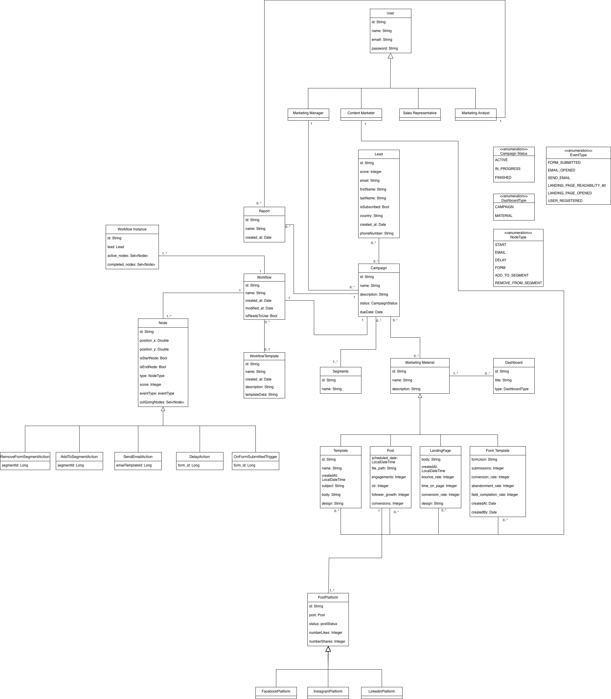

# Domain Model

The domain model represents the core structure of the **Marketing Automation Platform (MAP)**, describing the main entities, their attributes, and the relationships between them.  
It captures how users, marketing resources, campaigns, and analytics interact within the system.

## Overview

This model defines a marketing ecosystem where different types of users manage leads, design campaigns, automate workflows, and monitor performance through reports and dashboards.  
The UML diagram highlights inheritance, composition, and cardinality relationships that reflect how entities collaborate in the domain.

## Main Entities

### User Hierarchy
- **User** – Base class containing shared attributes (`id`, `name`, `email`, `password`).
- Specialized user roles:
  - **Marketing Manager**
  - **Content Marketer**
  - **Sales Representative**
  - **Marketing Analyst**  
  Each subclass extends `User` with role-specific identifiers and responsibilities.

### Campaign Management
- **Campaign** – Central entity coordinating marketing activities.  
  Includes attributes like `deadline`, `description`, and `status` (defined by the `CampaignStatus` enumeration: `ACTIVE`, `PENDING`, `FINISHED`).
- **Lead** – Represents potential customers tracked through campaigns.  
  Each lead has a `score`, contact information, and subscription status.
- **Segments** – Groups of leads sharing common traits, linked to campaigns.
- **Marketing Material** – Abstract superclass for materials used in campaigns:
  - **Mail**
  - **Post**
  - **Landing Page**
  - **Forms**  
  Each subtype includes relevant performance metrics (e.g., open rate, engagement, conversion rate).

### Workflow Automation
- **Workflow** – Defines automated marketing processes.  
  Contains multiple **Nodes** connected through **Edges**, describing the flow of actions.
  - **Node** – Represents a specific step in the workflow (`ACTION` or `TRIGGER`).
  - **Edge** – Connects nodes to define execution order.
  - **Template** – Stores reusable workflow structures.

### Analytics and Reporting
- **Report** – Summarizes performance data generated from campaigns, workflows, and materials.
- **Dashboard** – Visual interface for monitoring KPIs, classified by `DashboardType` (`CAMPAIGN`, `MATERIAL`).

## Key Relationships

- A **User** (such as a Marketing Manager or Analyst) can manage multiple **Campaigns**, **Reports**, and **Workflows**.
- Each **Campaign** is associated with multiple **Leads**, **Segments**, and **Marketing Materials**.
- **Workflows** are composed of **Nodes** and **Edges**, reflecting process logic.
- **Marketing Materials** are specialized into concrete classes (`Mail`, `Post`, `LandingPage`, `Forms`) sharing a common structure.
- **Reports** and **Dashboards** aggregate data across campaigns for analysis and decision-making.
